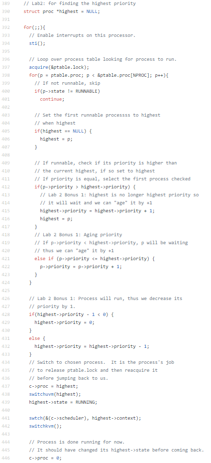

Lab 2 Report
============
Steven Nguyen - snguy057
Brittney Mun - bmun001

## Changes
### Makefile
Changed CPUs from 2 to 1 within the ifndef statement.
* Line 221: CPU := 1 instead of 2.

### defs.h
Added a call to the setpriority function from proc.c.
* Line 124: Created call to setpriority function.

### proc.c
Replace round robin scheduler with priority scheduler
* Line 244: Added "= 0" to the end of the function.
* Line 390: Initialized pointer to highest priority process.
* Lines 405 - 446: Implemented priority scheduler in place of round robin scheduler.
* Lines 432 - 436: BONUS 1 - Implemenation of process aging.
* Lines 631 - 652: Implementation of setpriority function.

### proc.h
Added priority variable to be used within priority scheduler.
* Line 53: Declaration of priority variable.

### syscall.c
Added system call to the priority scheduler.
* Line 107: Initialize sys call.
* Line 132: Add sys call.

### syscall.h
Defined value to represent setpriority system call within syscall.c
* Line 24: Defined SYS_setpriority to 23.

### sysproc.c.
Created system call function for setpriority.
* Line 113 - 120: Implementation of function.

### user.h
Added call
* Line 27:
TODO

### user.c
Added SYSCALL.
* Line 33:
TODO
