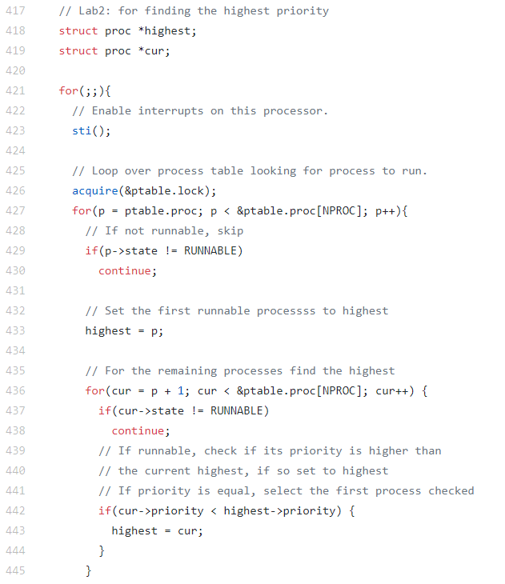

Lab 2 Report
============
Steven Nguyen - snguy057
Brittney Mun - bmun001

## Changes
### Makefile
Changed CPUs from 2 to 1 within the ifndef statement.
* Line 185: Added Lab 2.
* Line 221: CPU := 1 instead of 2.

### lab2.c
Test file added to verify functionality of Lab 2 code.

### defs.h
Added a call to the setpriority function from proc.c.
* Line 124: Created call to setpriority function.

### proc.c
Replace round robin scheduler with priority scheduler

#### Lab 2
* Line 93: Set default priority to 10.
* Lines 418 - 419: Declared pointers to current and highest priority process.
* Lines 433 - 482: Implemented priority scheduler over round robin scheduler. Contains bonuses within implementation.
* Lines 664 - 690: Implemented setpriority function.

#### Lab 2, Bonus 1
* Lines 447 - 466: Implemented priority aging.

#### Lab 2, Bonus 2
* Line 230: Implemented child priority inheritance.

#### Lab 2, Bonus 3
* Lines 96 - 97: Set default creation time and running time.
* Lines 282 - 294: Outputs turnaround and wait time.

### proc.h
Added priority variable to be used within priority scheduler.
* Lines 53 - 55: Declaration of priority, startTime, and runTime variables.

### syscall.c
Added system call to the priority scheduler.
* Line 107: Initialize sys call.
* Line 132: Add sys call.

### syscall.h
Defined value to represent setpriority system call within syscall.c
* Line 24: Defined SYS_setpriority to 23.

### sysproc.c.
Created system call function for setpriority.
* Line 113 - 120: Implementation of function.

### trap.c
Added function to increase runTime counter for bonus 3.
* Lines 55 - 60: If statement incrementing process run time is current process is still running.

### user.h
Added system call.
* Line 27: Added system call.

### usys.S
Added SYSCALL to assembly file.
* Line 33: Added SYSCALL to assembly file.
