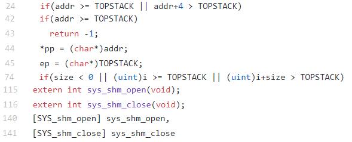
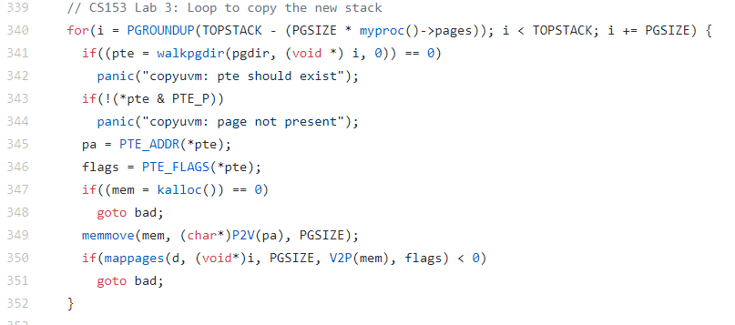
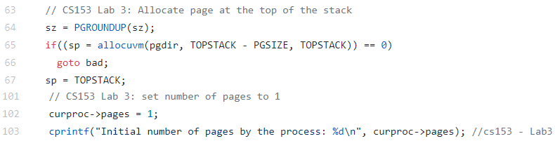
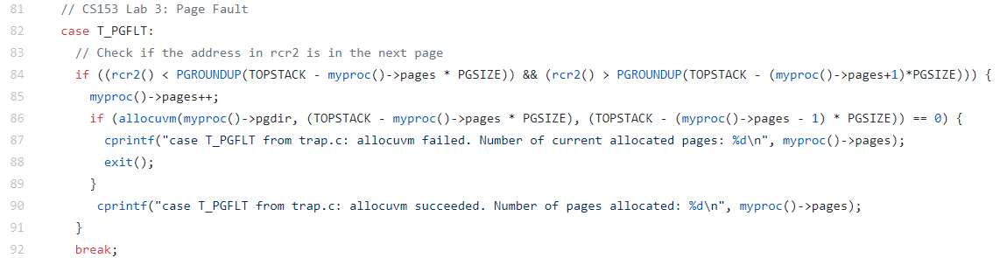
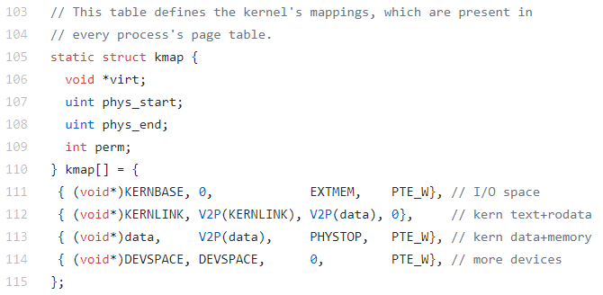

Lab 3 Report
============
Steven Nguyen - snguy057

Brittney Mun - bmun001

## Changes
### proc.h
Removed status, runtime, start time, and priority variables
* Line 52: Created uint pages, deleted 4 variables.

### memlayout.h
Defined top of stack address.
* Line 12: Removed char pointer declaration.
* Line 18: Defined memory address for top of stack.

### proc.c
Removed lab 2 content due to programming issues.

### syscall.c
Implemented Lab 3 by replacing cur-proc->sz with TOPSTACK throughout the file.
* Line 24, 42, 45, 74: Use TOPSTACK instead of curproc->sz.
* Line 115, 116: Syscall initialization.
* Line 140, 141: Syscall call.

### vm.c
Copies over information into virtual memory.
* Lines 340 - 350: Loop in order to copy information onto the new stack

### exec.c
Allocates all pages starting from the top of the stack. Replaces all sz with TOPSTACK.
* Line 65, 67: Replace sz with TOPSTACK.
* Line 102: Set number of pages to 1.

### trap.c
Implemeneted page faults
* Lines 81 - 93: Implemented page faults.

## Extra Credit
We were unable to implement a stack that grows into the heap because this would cause the stack to overlap the heap. As a result, the stack would overwrite information contained within the heap. The heap is allocated within vm.c and shown below. Within the I/O space is the heap. By growing the stack towards the heap, we effectively reach outside of the size limitations of the stack and cause an overflow, which would break the kernel and trigger an overflow error.

